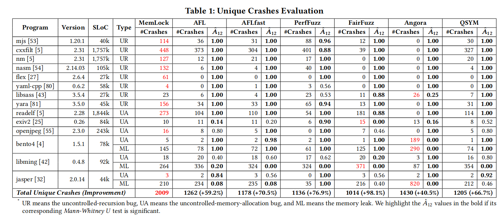

# Artifact Evaluation
This repository contains several experiments that we conducted to evaluate the [artifact](https://github.com/wcventure/MemLock-Fuzz/tree/acb4e40cb703f161314a731dc75ec71fe77fa3d3) of [MemLock (paper)](https://dl.acm.org/doi/abs/10.1145/3377811.3380396).

## Artifact
The artifact provided by the MemLock authors only contains a subset of the experiments performed as part of the paper. Details and concerns regarding the artifacts are summarized in the following:
- MemLock has been evaluated against six fuzzers, while the artifact supports only a single one (and MemLock itself)
- The paper states that MemLock is "implemented based on the AFL-2.52b framework", but the source code provided as part of the artifact is forked from PerfFuzz.
- The target configuration's are not uniform:
  -  Some targets (`flex`) set artificial stack size limits.
  -  The set `ASAN_OPTIONS` are target dependent, i.e., some targets have `allocator_may_return_null` enabled, while some have not. The same is true for the `detect_leaks` flag.

## Conducted Experiments

As part of a larger effort to reproduce and replicate fuzzing research, we have selected MemLock for reproduction. In the following, we outline the experiments we conducted to evaluate MemLock and the claims made in the paper. We intend to only partially evaluate some aspects or reproduce all experiments presented in the paper. Instead, we thoroughly studied the artifact and paper to compile experiments suitable to test for methodological flaws.


### [01-Artificial-Runtime-Environment](./01-Artificial-Runtime-Environment)
This experiment is specific to the target `flex` that has been evaluated as part of the paper's evaluation to answer RQ1:
> "How capable is MemLock in memory consumption crash detection?"

According to Table 1 of the paper, MemLock was the only fuzzer to find crashes in `flex`:


When studying the paper's artifact, we noticed that the configurations ([AFL](https://github.com/fuzz-evaluator/MemLock-Fuzz-upstream/blob/master/evaluation/FUZZ/run_AFL_flex.sh), [MemLock](https://github.com/fuzz-evaluator/MemLock-Fuzz-upstream/blob/master/evaluation/FUZZ/run_MemLock_flex.sh)) provided in the artifact contain the following line:
```
ulimit -s 2048
```
This flag sets the maximum stack size (see `ulimit`'s [man page](https://ss64.com/bash/ulimit.html)) to 2048 KiB, which is 25% of the default size of 8192 KiB.
Intuitively, an input is more likely to trigger a stack overflow (one of MemLock's advertised strengths) when the stack is smaller. Recursively calling functions is thus more likely to cause resource exhaustion than during regular operation.

Due to this artificial limit, we select `flex` as an experiment for reproducing MemLock's results and run it both with and without the manually lowered stack size.


#### **Results**
We briefly summarize the results of our experiment; to reproduce them, please refer to [01-Artificial-Runtime-Environment](./01-Artificial-Runtime-Environment).

> NOTE: The number of unique crashes depends on the instrumentation of the target, thus the numbers below should be interpreted as **crash was found** or **no crash was found** without considering the magnitude of the numbers themselves.


AFL **with** `ulimit` (results of ten independent runs):
```
/data/01-Artificial-Runtime-Environment/results# cat flex/out_AFL-afl-ulimit-*/fuzzer_stats  | grep crashes
unique_crashes    : 0
unique_crashes    : 0
unique_crashes    : 0
unique_crashes    : 2
unique_crashes    : 1
unique_crashes    : 1
unique_crashes    : 0
unique_crashes    : 1
unique_crashes    : 0
unique_crashes    : 0
```

AFL **without** `ulimit` (results of ten independent runs):
```
/data/01-Artificial-Runtime-Environment/results# cat flex/out_AFL-afl-noulimit-*/fuzzer_stats  | grep crashes
unique_crashes    : 0
unique_crashes    : 0
unique_crashes    : 0
unique_crashes    : 0
unique_crashes    : 0
unique_crashes    : 0
unique_crashes    : 0
unique_crashes    : 0
unique_crashes    : 0
unique_crashes    : 0
```

MemLock **with** `ulimit` (results of ten independent runs):
```
/data/01-Artificial-Runtime-Environment/results# cat flex/out_Mem*-ulimit-*/fuzzer_stats  | grep crashes
unique_crashes    : 53
unique_crashes    : 4
unique_crashes    : 39
unique_crashes    : 7
unique_crashes    : 10
unique_crashes    : 19
unique_crashes    : 10
unique_crashes    : 17
unique_crashes    : 28
unique_crashes    : 12
```

MemLock **without** `ulimit` (results of ten independent runs):
```
/data/01-Artificial-Runtime-Environment/results# cat flex/out_Mem*-noulimit-*/fuzzer_stats  | grep crashes
unique_crashes    : 0
unique_crashes    : 0
unique_crashes    : 0
unique_crashes    : 0
unique_crashes    : 0
unique_crashes    : 0
unique_crashes    : 0
unique_crashes    : 0
unique_crashes    : 0
unique_crashes    : 0
```

In summary, (1) **with** manually lowered stack size, both tools find crashes (even though MemLock finds more) but (2) **without** a manually lowered stack size, **no** tool finds a single crash.

We believe a fair evaluation should **not** set a lower stack size, as this behavior
1) diverges from the rest of the evaluation (only applied to a single target),
2) was not documented in the paper (but required studying the source code), and
3) benefitted MemLock without any real-world scenario backing this (when talking about memory corruption vulnerabilities, an argument can be made that they should not occur even when having an altered environment; however, for resource exhaustion bugs, constraining the resources will naturally lead to such an outcome. We believe this does not represent a security vulnerability in itself)

Additionally, comparing MemLock against AFL does not represent a fair comparison, as MemLock's source code is based on PerfFuzz (notwithstanding the paper claims its based on AFL, yet the published version is clearly not). This makes it difficult to judge whether the increased number of unique crashes (in itself a questionable metric, see below) can be attributed to MemLock or rather its baseline, PerfFuzz.

## [02-Unique-Crashes](./02-Unique-Crashes)
MemLock makes heavy use of _unique crashes_ as a metric during its evaluation and uses it as an indicator whether it outperformed other fuzzers as seen in Table 1:


Generally, the fuzzing community has doubted the efficacy of this metric, as many of these crashes often point to a single bug, despite the name indicating a sort of uniqueness.
To experimentally test whether this approach is suitable to compare different fuzzers, we designed an experiment were we _manually_ deduplicate unique crashes found by MemLock and AFL in order to determine how many crashes are related to a single cause (for implementation details, see [02-Unique-Crashes](./02-Unique-Crashes)).

For this experiment, we select the targets `readelf`, `cxxfilt` and `nm`. Each target was fuzzed 10 times for 24h by each fuzzer.

### Raw result
During the fuzzing runs conducted for the chosen targets, the following number of unique crashes have been found across all 10 runs (union of all runs):

| Fuzzer  | Target  | #Crashes |
| :------ | ------- | :------: |
| MemLock | readelf |   1100   |
| MemLock | cxxfilt |   5321   |
| MemLock | nm      |   1717   |
| AFL     | readelf |   3311   |
| AFL     | cxxfilt |   3684   |
| AFL     | nm      |   464    |

### Deduplicating crashes using available patch
To identify the true number of bugs, we manually deduplicate all unique crashes as follows: We first replay all crashing inputs on a patched version of the respective target. The used patch was made available by the
binutils maintainers in response to [CVE-2018-18484](https://cve.mitre.org/cgi-bin/cvename.cgi?name=CVE-2018-18484) that has been reported by the MemLock authors for `cxxfilt`.

The underlying idea is that all crashing inputs that no longer crash have been addressed by the bug fix, thus mapping to the single bug. If _unique crashes_ are indeed a good proxy metric for _actual bugs_, we would see most crashing inputs to still crash the target. Our obtained results were as follows:

| Fuzzer  | Target  | #Unique Crashes | #Crashes on Patched target |
| :------ | ------- | :-------------: | :------------------------: |
| MemLock | readelf |      1100       |            1100            |
| MemLock | cxxfilt |      5321       |             6              |
| MemLock | nm      |      1717       |             13             |
| AFL     | readelf |      3311       |            3311            |
| AFL     | cxxfilt |      3684       |             0              |
| AFL     | nm      |       464       |             8              |

From these results, two interesting **conclusion** can be drawn:

1. A considerable amount of the presumably unique crashes for `nm` and `cxxfilt` can be attributed to the same bug. This indicates that _unique crashes_ are no reliable indicator for the number of actual bugs in a target.
2. The reason we see the decreased number of inputs not only for `cxxfilt` but also `nm` is that the applied patch targets the library `libiberty`'s (part of binutils) demangling code which both targets are linked against. This shows that special care must be taken if targets sharing the same code base are fuzzed.

### Deduplicating via stack hashing
To analyze the remaining crashes, we opt for a (manual) analysis of stack backtraces.

#### `readelf`
For the `readelf` target 1100 and 3311 unique crashes for MemLock and AFL, respectively, remain. It is noteworthy that most crashes (100% for MemLock and 98.5% for AFL) are only triggered because the ASAN option `allocator_may_return_null=0` was set for `readelf` (contrary to most other targets, were this option was not set).

Manually inspecting the backtraces of MemLock's crashes quickly reveals that *all* 1100 crashes are caused by the same `cmalloc` statement that is supplied with a user-controlled variable. To reproduce this, run:
```
# The same function call is the root for all crashes (the frames above frame #8 belong to the allocator and ASAN)
/data/02-Unique-Crashes/results/filtered_crashes/readelf# cat MemLock/* | grep "#8 0x5735b6 in get_program_headers /workdir/MemLock/evaluation/BUILD/readelf_b9913fd2/SRC_MemLock/binutils/readelf.c:4761:33" | wc -l
1100
```

Similarly, when doing the same for AFL's crashes, we find that 3260 out of 3311 crashes are attributed to the same user-controlled `cmalloc` statement:
```
# The same function call is the root for all crashes (the frames above frame #8 belong to the allocator and ASAN)
/data/02-Unique-Crashes/results/filtered_crashes/readelf# cat AFL/* | grep "#8 0x571cb6 in get_program_headers /workdir/MemLock/evaluation/BUILD/readelf_b9913fd2/SRC_AFL/binutils/readelf.c:4761:33" | wc -l
3260
```
The remaining 51 crashes of AFL belong to a heap buffer overflow.
Effectively, this means that all unique crashes of MemLock map to a single bug, while AFL's crashes point to two different bugs.

#### `cxxfilt`
In the case of AFL, all 3684 `cxxfilt` crashes were resolved by applying the patch as mentioned earlier. The six remaining crashes in case of MemLock belong to the same bug that arises around the `demangle_expression` function, which is not protected by the stack depth counter introduced by the patch. Arguably, MemLock found a new bug, meaning the patch is incomplete.

#### `nm`
For `nm`, 13 and 8 crashes remain for MemLock and AFL, respectively. For both, all crashes belong to the same bug as triggered in `cxxfilt`. This is, again, caused by the fact that both targets linked against the same library, `libiberty`, which contains the affected code. Interestingly, the bug related to `demangle_expression` found by MemLock in `cxxfilt` was found by AFL in `nm`.

### Conclusion
Considering the initial number of unique crashes, our deduplication efforts paint a different picture:
| Fuzzer  | Target  | #Unique Crashes | #Bugs | Explanation                                                                                                       |
| :------ | ------- | :-------------: | :---: | :---------------------------------------------------------------------------------------------------------------- |
| MemLock | readelf |      1100       |   1   | All crashes have been caused by the same `cmalloc` statement that received user-controlled input                  |
| MemLock | cxxfilt |      5321       |   2   | One bug patched by the maintainers and another one from the 6 remaining crashes (``demangle_expression``)         |
| MemLock | nm      |      1717       |   0   | All crashes were also triggered in `cxxfilt`, since both targets depend on `libiberty`                            |
| AFL     | readelf |      3311       |   2   | In addition to the user-controlled `cmalloc` statement, AFL was also able to trigger a heap overflow              |
| AFL     | cxxfilt |      3684       |   1   | AFL found only the bug that was patched by the fix provided by the binutils authors                             |
| AFL     | nm      |       464       |   1   | While AFL did not found the bug related to the `demangle_expression` in `cxxfilt`, it was able to find it in `nm` |

Overall, AFL found 4 bugs, while MemLock found 3. The number of bugs is a completely different order of magnitude than the number of unique crashes. From this, we can draw the following conclusion:
1) _Unique crashes_ are *not* a good proxy metric for actual bugs found.
2) Special attention needs to be paid when fuzzing targets that *share* code (as is the case for binutils, one of the most popular fuzzing targets).


## 03-Reported-CVEs
MemLock found several vulnerabilities and, overall, received 26 CVEs, as listed in the [artifact repository](https://github.com/fuzz-evaluator/MemLock-Fuzz-upstream) (and repeated below for your convenience).

| #   | Vulnerability                                                                       | Package           | Program  | Vulnerability Type                      |
| --- | ----------------------------------------------------------------------------------- | ----------------- | -------- | --------------------------------------- |
| 1   | [**CVE-2020-36375**](https://cve.mitre.org/cgi-bin/cvename.cgi?name=CVE-2020-36375) | MJS 1.20.1        | mjs      | CWE-674: Uncontrolled Recursion         |
| 2   | [**CVE-2020-36374**](https://cve.mitre.org/cgi-bin/cvename.cgi?name=CVE-2020-36374) | MJS 1.20.1        | mjs      | CWE-674: Uncontrolled Recursion         |
| 3   | [**CVE-2020-36373**](https://cve.mitre.org/cgi-bin/cvename.cgi?name=CVE-2020-36373) | MJS 1.20.1        | mjs      | CWE-674: Uncontrolled Recursion         |
| 4   | [**CVE-2020-36372**](https://cve.mitre.org/cgi-bin/cvename.cgi?name=CVE-2020-36372) | MJS 1.20.1        | mjs      | CWE-674: Uncontrolled Recursion         |
| 5   | [**CVE-2020-36371**](https://cve.mitre.org/cgi-bin/cvename.cgi?name=CVE-2020-36371) | MJS 1.20.1        | mjs      | CWE-674: Uncontrolled Recursion         |
| 6   | [**CVE-2020-36370**](https://cve.mitre.org/cgi-bin/cvename.cgi?name=CVE-2020-36370) | MJS 1.20.1        | mjs      | CWE-674: Uncontrolled Recursion         |
| 7   | [**CVE-2020-36369**](https://cve.mitre.org/cgi-bin/cvename.cgi?name=CVE-2020-36369) | MJS 1.20.1        | mjs      | CWE-674: Uncontrolled Recursion         |
| 8   | [**CVE-2020-36368**](https://cve.mitre.org/cgi-bin/cvename.cgi?name=CVE-2020-36368) | MJS 1.20.1        | mjs      | CWE-674: Uncontrolled Recursion         |
| 9   | [**CVE-2020-36367**](https://cve.mitre.org/cgi-bin/cvename.cgi?name=CVE-2020-36367) | MJS 1.20.1        | mjs      | CWE-674: Uncontrolled Recursion         |
| 10  | [**CVE-2020-36366**](https://cve.mitre.org/cgi-bin/cvename.cgi?name=CVE-2020-36366) | MJS 1.20.1        | mjs      | CWE-674: Uncontrolled Recursion         |
| 11  | [**CVE-2020-18392**](https://cve.mitre.org/cgi-bin/cvename.cgi?name=CVE-2020-18392) | MJS 1.20.1        | mjs      | CWE-674: Uncontrolled Recursion         |
| 12  | [**CVE-2019-6293**](https://cve.mitre.org/cgi-bin/cvename.cgi?name=CVE-2019-6293)   | Flex 2.6.4        | flex     | CWE-674: Uncontrolled Recursion         |
| 13  | [**CVE-2019-6292**](https://cve.mitre.org/cgi-bin/cvename.cgi?name=CVE-2019-6292)   | Yaml-cpp v0.6.2   | prase    | CWE-674: Uncontrolled Recursion         |
| 14  | [**CVE-2019-6291**](https://cve.mitre.org/cgi-bin/cvename.cgi?name=CVE-2019-6291)   | NASM 2.14.03rc1   | nasm     | CWE-674: Uncontrolled Recursion         |
| 15  | [**CVE-2019-6290**](https://cve.mitre.org/cgi-bin/cvename.cgi?name=CVE-2019-6290)   | NASM 2.14.03rc1   | nasm     | CWE-674: Uncontrolled Recursion         |
| 16  | [**CVE-2018-18701**](https://cve.mitre.org/cgi-bin/cvename.cgi?name=CVE-2018-18701) | Binutils 2.31     | nm       | CWE-674: Uncontrolled Recursion         |
| 17  | [**CVE-2018-18700**](https://cve.mitre.org/cgi-bin/cvename.cgi?name=CVE-2018-18700) | Binutils 2.31     | nm       | CWE-674: Uncontrolled Recursion         |
| 18  | [**CVE-2018-18484**](https://cve.mitre.org/cgi-bin/cvename.cgi?name=CVE-2018-18484) | Binutils 2.31     | c++filt  | CWE-674: Uncontrolled Recursion         |
| 19  | [**CVE-2018-17985**](https://cve.mitre.org/cgi-bin/cvename.cgi?name=CVE-2018-17985) | Binutils 2.31     | c++filt  | CWE-674: Uncontrolled Recursion         |
| 20  | [**CVE-2019-7704**](https://cve.mitre.org/cgi-bin/cvename.cgi?name=CVE-2019-7704)   | Binaryen 1.38.22  | wasm-opt | CWE-789: Uncontrolled Memory Allocation |
| 21  | [**CVE-2019-7698**](https://cve.mitre.org/cgi-bin/cvename.cgi?name=CVE-2019-7698)   | Bento4 v1.5.1-627 | mp4dump  | CWE-789: Uncontrolled Memory Allocation |
| 22  | [**CVE-2019-7148**](https://cve.mitre.org/cgi-bin/cvename.cgi?name=CVE-2019-7148)   | Elfutils 0.175    | eu-ar    | CWE-789: Uncontrolled Memory Allocation |
| 23  | [**CVE-2018-20652**](https://cve.mitre.org/cgi-bin/cvename.cgi?name=CVE-2018-20652) | Tinyexr v0.9.5    | tinyexr  | CWE-789: Uncontrolled Memory Allocation |
| 24  | [**CVE-2018-18483**](https://cve.mitre.org/cgi-bin/cvename.cgi?name=CVE-2018-18483) | Binutils 2.31     | c++filt  | CWE-789: Uncontrolled Memory Allocation |
| 25  | [**CVE-2018-20657**](https://cve.mitre.org/cgi-bin/cvename.cgi?name=CVE-2018-20657) | Binutils 2.31     | c++filt  | CWE-401: Memory Leak                    |
| 26  | [**CVE-2018-20002**](https://cve.mitre.org/cgi-bin/cvename.cgi?name=CVE-2018-20002) | Binutils 2.31     | nm       | CWE-401: Memory Leak                    |


To better understand the real-world impact of MemLock, we have looked into these CVEs.


### CVEs reported for **mJS** (#1 to #11)
The `mJS` software is described as follows in its Github [repository](https://github.com/cesanta/mjs):
> mJS is designed for microcontrollers with limited resources. Main design goals are: small footprint and simple C/C++ interoperability. mJS implements a strict subset of ES6 (JavaScript version 6)

`mJS` is an interpreter that effectively parses Javascript to execute it.
Source code is typically processed as a tree and parsed top-down. For example, if a logical addition (`+`) is encountered, the parser processes either side (operand) until it reaches the bottom of the tree. This top-down parsing process naturally embodies the state that needs to be carried over to the next depth.

Since an attacker supplying Javascript code can nest these tree structures arbitrarily deep, they can exploit this parsing process to exhaust the available stack memory (typically, 8 MiB for Linux-based systems).

According to the CVE descriptions, all bugs reported by the authors of MemLock are related to stack overflows (i.e., the stack's size limit is reached) in some parsing functions of the form `parse_*`.

Studying the CVEs, we noticed that [CVE-2020-36375](https://cve.mitre.org/cgi-bin/cvename.cgi?name=CVE-2020-36375), [CVE-2020-36374](https://cve.mitre.org/cgi-bin/cvename.cgi?name=CVE-2020-36374), [CVE-2020-36373](https://cve.mitre.org/cgi-bin/cvename.cgi?name=CVE-2020-36373), [CVE-2020-36372](https://cve.mitre.org/cgi-bin/cvename.cgi?name=CVE-2020-36372), [CVE-2020-36371](https://cve.mitre.org/cgi-bin/cvename.cgi?name=CVE-2020-36371), and [CVE-2020-36370](https://cve.mitre.org/cgi-bin/cvename.cgi?name=CVE-2020-36370) *all* refer to the same [bug report 136](https://github.com/cesanta/mjs/issues/136) and only differ in the name of the causing function. These function names have been picked from the stack trace that led to the resource exhaustion:
```
    #283 0x599c92 in parse_assignment /home/hjwang/UAF_Objects/mjs_afl_asan/mjs.c:12532:3
    #284 0x5acfb4 in parse_expr /home/hjwang/UAF_Objects/mjs_afl_asan/mjs.c:12536:10
    #285 0x5acfb4 in parse_array_literal /home/hjwang/UAF_Objects/mjs_afl_asan/mjs.c:12294
    #286 0x5a7a58 in parse_literal /home/hjwang/UAF_Objects/mjs_afl_asan/mjs.c:12354:13
    #287 0x5a7a58 in parse_call_dot_mem /home/hjwang/UAF_Objects/mjs_afl_asan/mjs.c:12380
    #288 0x5a6400 in parse_postfix /home/hjwang/UAF_Objects/mjs_afl_asan/mjs.c:12414:14
    #289 0x5a6400 in parse_unary /home/hjwang/UAF_Objects/mjs_afl_asan/mjs.c:12433
    #290 0x5a5a6e in parse_mul_div_rem /home/hjwang/UAF_Objects/mjs_afl_asan/mjs.c:12446:3
    #291 0x5a5236 in parse_plus_minus /home/hjwang/UAF_Objects/mjs_afl_asan/mjs.c:12451:3
    #292 0x5a4b00 in parse_shifts /home/hjwang/UAF_Objects/mjs_afl_asan/mjs.c:12456:3
    #293 0x5a441e in parse_comparison /home/hjwang/UAF_Objects/mjs_afl_asan/mjs.c:12460:3
    #294 0x5a3c4f in parse_equality /home/hjwang/UAF_Objects/mjs_afl_asan/mjs.c:12464:3
    #295 0x5a24ab in parse_bitwise_and /home/hjwang/UAF_Objects/mjs_afl_asan/mjs.c:12469:3
    #296 0x5a0bec in parse_bitwise_xor /home/hjwang/UAF_Objects/mjs_afl_asan/mjs.c:12474:3
    #297 0x59f1ab in parse_bitwise_or /home/hjwang/UAF_Objects/mjs_afl_asan/mjs.c:12479:3
    #298 0x59d944 in parse_logical_and /home/hjwang/UAF_Objects/mjs_afl_asan/mjs.c:12484:3
```

Since the issue is bound to one specific function and caused by too many stacked stack frames, it does not make sense to report a specific function being the reason for the crash.

The same problem can be observed by looking at the other CVEs assigned for `mJS`. The CVEs [CVE-2020-36369](https://cve.mitre.org/cgi-bin/cvename.cgi?name=CVE-2020-36369), [CVE-2020-36368](https://cve.mitre.org/cgi-bin/cvename.cgi?name=CVE-2020-36368) and [CVE-2020-36367](https://cve.mitre.org/cgi-bin/cvename.cgi?name=CVE-2020-36367) all reference the same [bug report 135](https://github.com/cesanta/mjs/issues/135). Similarly, we observe that [CVE-2020-36366](https://cve.mitre.org/cgi-bin/cvename.cgi?name=CVE-2020-36366) and [CVE-2020-18392](https://cve.mitre.org/cgi-bin/cvename.cgi?name=CVE-2020-18392) both belong to [bug report 106](https://github.com/cesanta/mjs/issues/106).

In summary, from eleven CVEs assigned for bugs found in mjs, only three belong to actual bug reports, with the other eight picking different function names from the respective back traces for the CVE description.
